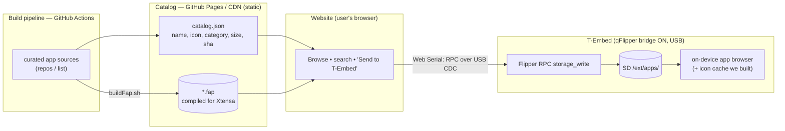

# T-Embed App Store + coloranim Manager — Plan

Two features planned here. **coloranim manager** is a small warm-up; the **app store**
is the big one. Connection model chosen: **USB / Web Serial** (most beginner-seamless,
no WiFi setup, no accounts, reuses the flasher pattern).

---

## Status — 2026-08-18: the spike WORKS ✅

One-click USB install is **proven end-to-end**: the Flipper-themed site (`store/`)
connects over Web Serial, speaks Flipper RPC, and writes a **complete, launchable**
`.fap` to `/ext/apps/<cat>/`. Settled decisions: site uses the **Flipper pixel theme**
(done); the **owner verifies** which apps actually run (curation); each app carries a
**firmware-compat tag** (`stock` vs `modified`) that CI can auto-set from the FAP's
undefined-symbol check.

### RPC-over-USB protocol facts (learned the hard way — for whoever builds the CI/site)
- The USB CDC only accepts input once the host asserts **DTR** (`setSignals({dataTerminalReady:true})`).
- The CLI prompt is `>: `; sending `start_rpc_session\r` switches this single CDC channel into protobuf RPC.
- **Flush the RX buffer** after `start_rpc_session` (drop the CLI echo) before parsing RPC frames, or the CLI `\r` gets read as a message length and desyncs the parser.
- `storage_write` chunking: use **one command_id for the whole file** (a change mid-write makes the device reset and re-truncate via `FSOM_CREATE_ALWAYS`), and the device **replies only on the final chunk** (`has_next=false`) — stream the intermediate chunks with light pacing so its RPC buffer drains.
- Frames are length-delimited protobuf (varint length + PB_Main). Tags: `PB_Main.storage_write_request=11`, `mkdir=13`, `WriteRequest{path=1, file=2}`, `File.data=4`, `command_status=2`.

Working implementation of all of the above lives in `store/index.html`.

## Key finding — the device side is already done

The port already implements the **full Flipper RPC over USB CDC**:
- `components/rpc/rpc_storage.c` → `rpc_system_storage_write_process` (write), `_list_`,
  `_mkdir_`, etc.; protobuf in `components/flipper_protobuf/flipper.pb.*`.
- The USB composite (`furi_hal_usb_tinyusb_composite.c`) exposes the RPC channel; the
  device **VID/PID-spoofs a real Flipper** (qFlipper bridge, enabled from the lock menu).

Because it *is* the real Flipper RPC, **existing Flipper Web-Serial RPC libraries work
against it unmodified.** So the "click → lands on the SD" magic is not device work — it's
a Web-Serial client in the website calling `storage_write` to `/ext/apps/<cat>/<app>.fap`.

**Consequence:** we build a **catalog** and a **website**. We do *not* build a serial
protocol, a backend, or a device-side installer.

---

## Architecture (USB / Web Serial)

---

## Phase 0 — coloranim on-device manager (warm-up, ~1-2 days)

Extend the existing `applications_user/coloranim` FAP:
- **Thumbnail per pack** — decode frame 0 of each `frames.bin`, draw it small next to the
  name (RGB565 → the mono list, or a color preview panel on selection).
- **Delete** a pack (storage remove of the folder).
- **Favorite / set default** — persist a choice (small settings file).
- Stretch: **"use as idle animation"** — hook the color player into the desktop idle loop.
  This one is firmware (desktop service), not FAP — defer unless wanted.

No new infra; ships as a `.fap`.

---

## Phase 1 — FAP catalog + build pipeline (the foundation)

This is *why* a store is possible here: the official Flipper catalog ships **ARM**
binaries that can't run on Xtensa. We publish **Xtensa-compiled** `.fap`s.

**Tasks**
1. A repo (or folder) listing curated app sources (git URL + subdir + build notes).
2. GitHub Actions workflow: for each app → `buildFap.sh` against the T-Embed target in a
   container with ESP-IDF v5.4.1 → collect `<app>.fap`.
3. Generate `catalog.json`: per app `{ id, name, category, description, author, size,
   sha256, icon (base64 10x10), fap_url }`. Pull name/icon from the built `.fap` manifest.
4. Publish `.fap` files + `catalog.json` to **GitHub Pages** (free static hosting/CDN).

**Risk (the real one): app compatibility.** Not every upstream app builds/runs on this
port (Xtensa, HAL gaps, encoder input). The catalog must be a **curated, tested** list —
start with the ~4 we ported + the port's known-good apps, expand as each is verified. The
CI proves *builds*; a human (or an on-device smoke test) proves *runs*.

---

## Phase 2 — the website (browse + one-click install)

Static site (can live in the same Pages repo). Two halves:
1. **Catalog browser** — fetch `catalog.json`, render cards (icon, name, category, size,
   description), search/filter. Pure static; trivial.
2. **"Send to T-Embed"** — on click:
   - `navigator.serial.requestPort()` (Web Serial; Chromium only — same as the flasher).
   - Speak Flipper RPC: open session → `storage_mkdir` `/ext/apps/<cat>` → `storage_write`
     the `.fap` (chunked) → close. Reuse an existing Flipper Web-Serial RPC lib.
   - Progress bar + "Done — find it under Apps → <cat> on your device."
   - Guard: detect if the bridge isn't enabled and show "On your T-Embed: Lock menu →
     qFlipper, then retry."

**Spike first (highest-leverage single step):** before any CI/catalog, prove the whole
"magic" end-to-end — a throwaway page that Web-Serial-connects and `storage_write`s **one**
hand-picked `.fap` to `/ext/apps/`. If that lands and the app launches, everything else is
just content + UI. If the RPC framing fights us, we learn it cheaply.

---

## Phase 3 — on-device app manager polish

Mostly exists: the "Apps" browser (`loader_applications.c`) already lists/launches FAPs and
now caches names/icons. Add:
- **Delete** from the browser (long-press → confirm → `storage_remove`).
- Category folders already work via `/ext/apps/<cat>/`.
- Optional: a "Recently installed" view fed by a marker the website writes.

---

## Open questions to settle

1. **Seed catalog** — which apps ship first? (the 4 we ported + which known-good port apps?)
2. **Curation owner** — who vets that an app *runs*, not just builds? (this is the ongoing cost)
3. **RPC lib** — reuse which existing Flipper Web-Serial project, or write a minimal client?
4. **Hosting** — GitHub Pages under your account, or the upstream project's?
5. **Bridge UX** — the site must tell first-timers to enable qFlipper mode once.

---

## Recommended order

1. **Phase 2 spike** — prove Web-Serial RPC install of one `.fap` (de-risks the core magic).
2. **Phase 0** — coloranim manager (quick, visible win while the spike settles).
3. **Phase 1** — catalog + CI once the install path is proven.
4. **Phase 2 full** + **Phase 3** — website UI + on-device delete.
